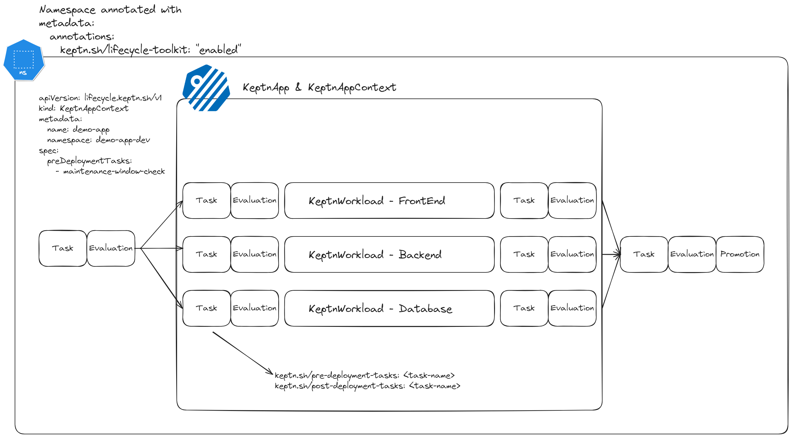

# The System Explained

The workshop environment is now completely installed. If you look at Argo, you will notice a couple things.

A `demo-app-dev` and a `demo-app-prod` is already installed, alongside with all other tools mentioned before.

During the workshop, you will interact with the following components:

- [`KeptnAppContext`](#keptnappcontext)
- [`KeptnTaskDefinition`](#keptntaskdefinition)
- [`KeptnEvaluationDefinition`](#keptnevaluationdefinition)
- [`KeptnMetric`](#keptnmetric)
- [`KeptnMetricsProvider`](#keptnmetricsprovider)
- [`AnalysisDefinition`](#analysisdefinition)
- [`AnalysisValueTemplate`](#analysisvaluetemplate)

## Keptn in a Nutshell



## KeptnAppContext

The [KeptnAppContext](https://keptn.sh/stable/docs/reference/crd-reference/appcontext/) custom resource works with the corresponding KeptnApp resource that has the same name and is located in the same namespace. It allows you to

- Add metadata and links to traces for a specific application. This enables you to enrich your traces with additional information that you can use to better understand and analyze the performance of your applications.

- Define tasks and evaluations that run before or after the deployment of the KeptnApp.

```yaml
apiVersion: lifecycle.keptn.sh/v1
kind: KeptnAppContext
metadata:
  name: demo-app
  namespace: demo-app-dev
spec:
  preDeploymentTasks:
    - maintenance-window-check
  postDeploymentTasks:
    - load-test
  postDeploymentEvaluations:
    - demoapp-heatlh-check
  promotionTasks:
    - promote
```

## KeptnTaskDefinition

A [KeptnTaskDefinition](https://keptn.sh/stable/docs/reference/crd-reference/taskdefinition/) defines tasks that Keptn runs as part of the pre- and post-deployment phases of a KeptnApp or KeptnWorkload.

A `KeptnTask` could be executed on each Workload or on [Application](#keptnappcontext) Level.

```yaml
apiVersion: lifecycle.keptn.sh/v1alpha3
kind: KeptnTaskDefinition
metadata:
  name: maintenance-window-check
  namespace: demo-app-dev
spec:
  retries: 3
  timeout: "5m"
  python:
    httpRef: 
      url: 'https://raw.githubusercontent.com/heckelmann/kyverno-keptn-workshop/main/functions/checkmaintenance.py'
```

To assign this KeptnTask to a KeptnApp, you need to add it to the `KeptnAppContext`, as shown in the example above.

To assign the task to a specific workload, you need to add the following annotations to the deployment manifest:

```yaml
keptn.sh/pre-deployment-tasks: <task-name>
keptn.sh/post-deployment-tasks: <task-name>
```

## KeptnEvaluationDefinition

A [KeptnEvaluationDefinition](https://keptn.sh/stable/docs/reference/crd-reference/evaluationdefinition/) assigns target values to KeptnMetric queries. These are used as part of evaluation tasks that Keptn runs as part of pre- and post-analysis phases of a KeptnApp or workload.

```yaml
apiVersion: lifecycle.keptn.sh/v1alpha3
kind: KeptnEvaluationDefinition
metadata:
  name: demoapp-heatlh-check
  namespace: demo-app-dev
spec:
  objectives:
    - keptnMetricRef:
        name: demoapp-latency
        namespace: demo-app-dev
      evaluationTarget: "<1" # less than 1 second
```

## KeptnMetric

A [KeptnMetricsProvider](https://keptn.sh/stable/docs/reference/crd-reference/metricsprovider/) resource defines an instance of a data provider (such as Prometheus, Thanos, Cortex, Dynatrace, or Datadog) that is used by one or more KeptnMetric resources.

```yaml
apiVersion: metrics.keptn.sh/v1alpha3
kind: KeptnMetric
metadata:
  name: demoapp-latency
  namespace: demo-app-dev
spec:
  provider:
    name: prometheus
  query: 'sum by (path) (rate(http_request_duration_seconds_sum{namespace="demo-app-dev", path="/"}[2m]) / rate(http_request_duration_seconds_count{namespace="demo-app-dev", path="/"}[2m]))'
  fetchIntervalSeconds: 5
```

## KeptnMetricsProvider

A [KeptnMetric](https://keptn.sh/stable/docs/reference/crd-reference/metric/) represents a metric that is collected from a provider. Providing the metrics as a custom resource facilitates the reusability of this data across multiple components and allows using multiple observability platforms for different metrics at the same time.

```yaml
apiVersion: metrics.keptn.sh/v1alpha3
kind: KeptnMetricsProvider
metadata:
  name: prometheus
  namespace: demo-app-dev
spec:
  type: prometheus
  targetServer: "http://prometheus-operated.monitoring.svc.cluster.local:9090"
```

## AnalysisDefinition

An [AnalysisDefinition](https://keptn.sh/stable/docs/reference/crd-reference/analysisdefinition/) resource defines the list of Service Level Objectives (SLOs) for an Analysis.

## AnalysisValueTemplate

An [AnalysisValueTemplate](https://keptn.sh/stable/docs/reference/crd-reference/analysisvaluetemplate/) resource defines a Service Level Indicator (SLI), which identifies the data to be analyzed by a data source to use and the query to issue. One Analysis can use data from multiple AnalysisValueTemplates.

```yaml

```