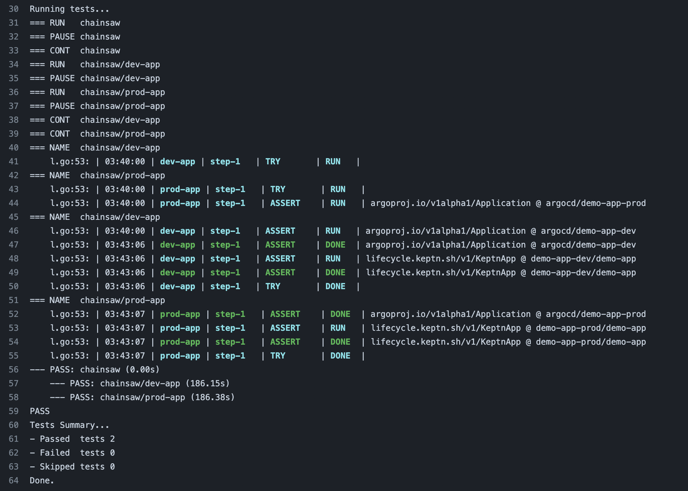

# Testing The System

While the workshop environment has been completely installed, there's no test to guarantee that a specific change will continue to work.

To test that the system can be installed correctly you will add a Chainsaw test to verify that ArgoCD applications sync successfully and that Keptn created the corresponding KeptnApp resources.

Full documentation of Chainsaw can be found [here](https://kyverno.github.io/chainsaw/latest/).

## Exercise

In this exercise, you will create a Chainsaw test to verify that both `demo-app-dev` and `demo-app-prod` have been successfully synced in the cluster by ArgoCD.

### Create the Chainsaw test

Create a new file `chainsaw-test.yaml` in the `tests/04-test-the-system` folder of your repository and add the following content:

```yaml
# yaml-language-server: $schema=https://raw.githubusercontent.com/kyverno/chainsaw/main/.schemas/json/test-chainsaw-v1alpha1.json
apiVersion: chainsaw.kyverno.io/v1alpha1
kind: Test
metadata:
  name: dev-app
spec:
  namespace: argocd
  steps:
  - try:
    - assert:
        timeout: 10m
        resource:
          apiVersion: argoproj.io/v1alpha1
          kind: Application
          metadata:
            name: demo-app-dev
          status:
            health:
              status: Healthy
            sync:
              status: Synced
    - assert:
        timeout: 5m
        resource:
          apiVersion: lifecycle.keptn.sh/v1
          kind: KeptnApp
          metadata:
            name: demo-app
            namespace: demo-app-dev
---
# yaml-language-server: $schema=https://raw.githubusercontent.com/kyverno/chainsaw/main/.schemas/json/test-chainsaw-v1alpha1.json
apiVersion: chainsaw.kyverno.io/v1alpha1
kind: Test
metadata:
  name: prod-app
spec:
  namespace: argocd
  steps:
  - try:
    - assert:
        timeout: 10m
        resource:
          apiVersion: argoproj.io/v1alpha1
          kind: Application
          metadata:
            name: demo-app-prod
          status:
            health:
              status: Healthy
            sync:
              status: Synced
    - assert:
        timeout: 5m
        resource:
          apiVersion: lifecycle.keptn.sh/v1
          kind: KeptnApp
          metadata:
            name: demo-app
            namespace: demo-app-prod
```

The two tests above are self-explanatory, they check the existence of ArgoCD and Keptn resources, validating those resources are in the expected state.

### Testing changes

To let GitHub actions run the tests above, create a new file `chainsaw.yaml` in the `.github/workflows` folder of your repository and add the following content:

```yaml

name: Chainsaw

on:
  pull_request:
    branches:
      - main

concurrency:
  group: ${{ github.workflow }}-${{ github.ref }}
  cancel-in-progress: true

jobs:
  build:
    name: Chainsaw tests
    runs-on: ubuntu-latest
    steps:
      - name: Checkout code
        uses: actions/checkout@v2

      - name: Setup cluster
        run: make

      - name: Install chainsaw
        uses: kyverno/action-install-chainsaw@v0.2.5

      - name: Run chainsaw tests
        run: chainsaw test ./tests/04-test-the-system

```

### Apply the changes

Commit and push the changes to your repository and wait for the deployment to finish.

### Open a pull request

With the changes above, GitHub will execute the Chainsaw tests for every pull request.



You can allow (or block) pull request merges based on the test outcome.


### Summary

In this exercise, you have learned how to write Chainsaw tests and run them in your CI pipelines using GitHub workflows.
